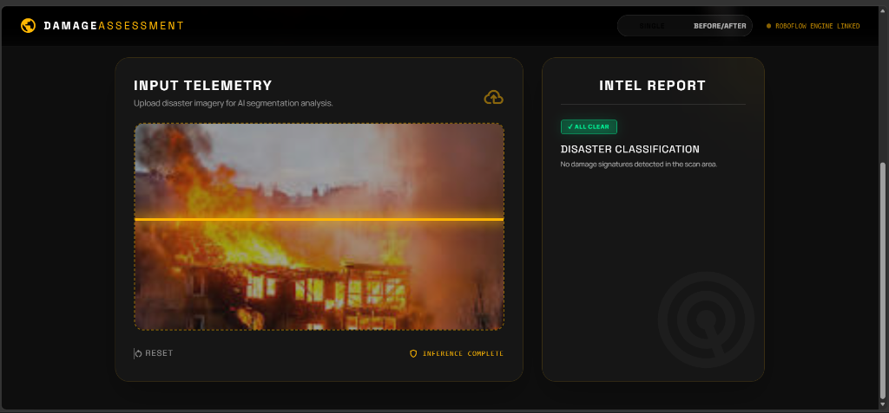
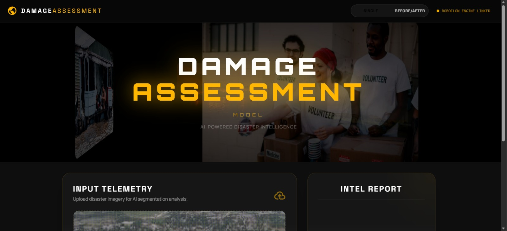

<div align="center">

# Damage Assessment System
**A real-time, high-performance disaster intelligence and computer vision pipeline.**

[](https://fastapi.tiangolo.com/)
[](https://vitejs.dev/)
[](https://tailwindcss.com/)
[](https://roboflow.com/)

---

<p align="center">
  
</p>

</div>

## Overview

The **Damage Assessment System** is an industry-grade web application designed for rapid disaster telemetry analysis. By utilizing Roboflow's serverless workflows and a custom FastAPI proxy, the system analyzes airborne drone imagery or satellite feeds to classify disasters and assess structural damage severity.

### Key Features
- **Strict Authorization**: Roboflow API keys are proxy-secured via the backend environment.
- **Base64 Inference Engine**: Serverless image chunking and streaming directly through memory.
- **Dual-Mode Telemetry**: Dedicated operational modes for Single Scan Analysis and Before/After Structural Comparisons.

---

## Application Interface

<p align="center">
  
  
</p>

---

## Implementation Architecture

To ensure separation of concerns and maximum credential security, the repository enforces a strict Frontend and Backend structural split.

### 1. Frontend Setup

This repository contains the interactive user interface. 

```bash
# Clone the repository
git clone git@github.com:Aditgm/damage_assessment.git
cd damage_assessment

# Install dependencies
npm install

# Initialize development server
npm run dev
```
*The client application expects the local backend gateway to be active on port `8000`.*

### 2. Backend Setup

*Note: For security reasons, backend configuration files and source code are maintained separately and are not tracked in this repository.*

Obtain the `backend_release.zip` package and extract it to a secure location.

1. **Configure Environment Variables**: Rename `.env.example` to `.env` and assign your `ROBOFLOW_API_KEY`.
2. **Install Python Dependencies**:
   ```bash
   pip install -r requirements.txt
   ```
3. **Initialize the FastApi Gateway**:
   ```bash
   python -m uvicorn app:app --host 127.0.0.1 --port 8000
   ```
*The proxy service will natively listen for inference payloads at the `/scan` endpoint.*
